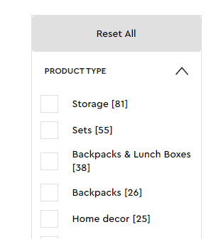

# Data_Collection_Pipeline

> The Goal of this project is to harvest data from lego.

## Milestones 1-2

- I'm making use of the packages BeautifulSoup and Selenium to interact with the lego website. Selenium can open up a chrome window and operate the browser using python commands. BeautifulSoup can take a string of html code and recognize the tags in it. It gives commands for calling tags and then performing methods with those tags (the tags are a class) - such as finding parents, siblings, and children that respect certain conditions.

- As a child I quite enjoyed lego, but I'm blown away by the surge in price for lego sets since purchasing them as a preteen. I'm quite intrigued to harvest data, particularly pricing data, and see if I can find trends.

## Milestone 3

- For this milestone, I ran into some hiccups. Selenium offers several means to find elements on a page - xpath, class, id and a couple others. However, I found these means to be quite limited. The only attribute that all elements share uniquely on lego's site is the xpath. And I had a couple unsettling experiences where it changed slightly and broke my code.

- Thus, I first resolved to find all elements through BeautifulSoup. BeautifulSoup's .find method offers a far more versatile means of calling elements. For example, one can pass a true / false function into the argument, and the method will run the function on each tag and return the first tag for which the function returns "true". This allows for much more reliable conditions in searching for elements. I wrote a method which generates the xpath for an element found through BeautifulSoup, allowing it to be fed into Selenium:

```
    def build_xpath(self, element):
    
        components = []
        
        for parent in element.parents:
            
            siblings = parent.find_all(element.name, recursive = False)
            
            if len(siblings) == 1:
                components.append(element.name)
                
            else:
                for index, sibling in enumerate(siblings, 1):
                    if sibling is element:
                        components.append(f'{element.name}[{str(index)}]')
                        
            element = parent
        
        components.reverse()
        return('/' + '/'.join(components))
```

- The other key decision I made was compiling all elements I wish to interact with into a dictionary. The dictionary maps each element (given a descriptive name) to the condition used to call the element via BeautifulSoup's .find method and the parent element object through which .find will be called. I found centralizing and standardizing all the element interactions to be greatly beneficial in case one condition stops working and for keeping ugly addresses and conditions out of the flow of the code.

- Below is a part of the dictionary of relevant elements, and below that is the method which takes elements from the dictionary and yields the BeautifulSoup element object:

```
dictionary = {
    #Front page elements
    'age_check_overlay' : {
        'condition' : lambda tag : tag.has_attr('class') and tag['class'] == ['AgeGatestyles__Wrapper-xudtvj-0', 'itkEkg'],
        'dependency' : 'front_page'
    },
    
    'age_check_button' : {
        'condition' : lambda tag : tag.name == 'button' and tag.get_text() == 'Continue',
        'dependency' : 'age_check_overlay'
    },
    
    'cookie_accept_button' : {
        'condition' : lambda tag : tag.name == 'button' and tag.get_text() == 'Accept All',
        'dependency' : 'front_page'
    },
    
    #Product list elements
    'sets_checkbox_and_label' : {
        'condition' : lambda tag : tag.has_attr('data-test') and tag['data-test'] == 'checkbox-label' and \
            tag.find_all(lambda child : child.get_text().count('Sets') == 1) != [],
        'dependency' : 'product_list'
    },
    
    'sets_checkbox' : {
        'condition' : lambda tag : tag.has_attr('class') and tag['class'] == ['Checkboxstyles__CheckboxContainer-sc-19qo4tm-4', 'jrFByh'],
        'dependency' : 'sets_checkbox_and_label'
    },
    
    'page_info' : {
        'condition' : lambda tag : tag.has_attr('class') and tag['class'] == ['ProductGridstyles__Grid-lc2zkx-0', 'eGsxII'],
        'dependency' : 'product_list'
    },
    
    'show_all_button' : {
        'condition' : lambda tag : tag.has_attr('class') and tag['class'] == ['LinksNextstyles__AnchorButton-sc-1sxojvh-1', 'kARNPN', 'Paginationstyles__ShowAllLink-npbsev-13', 'iWkTte'],
        'dependency' : 'product_list'
    },
```

```
    def find_element_soup(self, element_name):
        
        element = self.elements[element_name]
        
        if element['dependency'] == self.webpage:
            parent = BeautifulSoup(self.driver.execute_script("return document.documentElement.outerHTML;"), 'html.parser')
        else:
            parent = self.find_element_soup(element['dependency'])
        
        return parent.find(element['condition'])
```

- In the dictionary, we see elements whose calling is greatly expedited by BeautifulSoup's functionality - The 'sets_checkbox_and_label' element is one of many checkboxes on the product list page - all with identical class names/structure. The only way to distinguish between them to my knowledge would be to use their position or to use the text in the label of its descendant (in this case, 'sets').



- The dictionary is long, but it makes the other methods and their calling very routine:

```
    def navigate(self, URL, webpage_name):
        
        self.driver.get(URL)
        self.webpage = webpage_name
    
    
    
    def click_button(self, button_name):
        
        try:
            self.find_element(button_name).click()
        except:
            print(f'failed to press button {button_name} on page {self.webpage}.')
            
        time.sleep(1)
    
    
    
    def click_buttons(self, buttons):
        
        for button_name in buttons:
            self.click_button(button_name)
    
    
    
    def wait_for(self, element_name, appear = 'appear', period = 10, print_warning = True):
        
        starting_time = time.time()
        
        while True:
            
            if (self.find_element_soup(element_name) == None) and (appear == 'disappear'):
                return True
            if (self.find_element_soup(element_name) != None) and (appear == 'appear'):
                return True
            
            if time.time() > starting_time + period:
                if print_warning:
                    print(f"waited {period} seconds for element {element_name} to {appear}. But it never did.")
                return False
```

- I am proud of the readability of these methods. They choose elements via readable names. Here is an example of their usage to navigate the lego website and harvest links:

```
if __name__ == '__main__':
    
    lego = Scraper(l.front_page_link, 'front_page')
    lego.elements = l.dictionary
    lego.wait_for('age_check_overlay')
    lego.click_buttons(['age_check_button', 'cookie_accept_button'])
    
    details_page_links = []
    for product_list_link in l.product_list_links:
        
        lego.navigate(product_list_link, 'product_list')
        if lego.wait_for('survey_window', period = 5, print_warning = False):
            lego.click_button('survey_window_no')
        lego.click_button('sets_checkbox')
        lego.wait_for('show_all_button')
        lego.click_button('show_all_button')
        
        lego.wait_for('page_bottom_post_show_all')
        condition = lambda element : element.get_text().split()[1] == element.get_text().split()[-1]
        lego.scroll_to_bottom('page_bottom_post_show_all', 'showing_x_of_y_text', condition)
        
        condition = lambda tag : tag.has_attr('data-test') and tag['data-test'] == 'product-leaf-title-link'
        details_page_links = details_page_links + lego.harvest_links('page_info', condition)
```

### Milestone 4

- With the provisions made in Milestone 3, the methods to harvest text and image links were fairly routine.

```
    def harvest_image_sources(self, element_list, condition = lambda tag : tag.name == 'img'):
        
        picture_elements = [self.find_element_soup(element_name).find_all(condition) for element_name in element_list]
        picture_elements_flattened = [picture_element for sublist in picture_elements for picture_element in sublist]
        
        return [picture_element.get('src').split('?')[0] for picture_element in picture_elements_flattened]
    
    
    
    def harvest_text_from_elements(self, element_list):
        
        get_text_of = lambda element_name : self.find_element_soup(element_name).get_text(separator = '¬')
        
        return {element_name : get_text_of(element_name) for element_name in element_list}
```

- Through the use of list and dictionary comprehensions, we can make the methods fairly compact too. It seemed natural to also allow one to specify particular elements to harvest text from - to avoid the page's clutter.

- However, though I know vaguely I'm interested in price, I wasn't sure whether I'd want to measure more data points later. Or if maybe I'd need to extract the same data from different elements at other times. I already have a nice way of storing elements of interest via the dictionary so I built on this by creating functionality to easily add new elements to extract text data from. For example, I discovered a particular page where the element I extracted the product name from didn't work - I originally called it from the same element I used to get ratings. However, this page had no ratings because the product was new!


- Creating a new element to harvest the name had 2 steps. Firstly, I added the element to the dictionary: 

```
    'item_name' : {
        'condition' : lambda tag : tag.has_attr('data-test') and tag['data-test'] == 'product-overview-name' and \
            tag.has_attr('itemprop') and tag['itemprop'] == 'name',
        'dependency' : 'webpage',
        'filters' : {'text_elements'}
    }
```

- The 'filters' key means this element will be picked up when we ask to harvest text from all elements with this filter. (There is a new method which calls all elements from the dictionary with a particular set of filters). Then I added the element to the schema for our raw_data dictionary:

```
data_schema = {'ID' : ['item_stats', 6],
                'Name' : ['item_name'],
                'Price' : ['item_price', 1],
                'Age' : ['item_stats', 0],
                'Pieces' : ['item_stats', 2],
                'Average Rating' : ['item_rating', 1],
                'Number of Ratings' : ['item_rating', 3],
                'Description' : ['item_description'],
                'Image Links' : ['img_links'],
                'UUID' : ['UUID']}
```

- The numbers specify if we want to take text from a particular part of an element. If in the future there are more complicated text extractions we need to make, by adjusting one line of code I can allow lambda functions to be placed there for more complicated manipulations. In our case, the element we chose contains the name and name only, so I just write 'item_name' and put it in a list - the schema now knows to pull the text for 'Name' from the element we've named 'item_name' in our dictionary. This method handles the grizzly details:

```
    def collect_product_data(self, link, download_pics = False):
        
        self.navigate(link, 'details_page')
        self.clear_survey_window()
    
        imgs = self.harvest_image_sources(self.filter_elements(['image_elements']))
        text = self.harvest_text_from_elements(self.filter_elements(['text_elements']))
        spl_text = {element_name : element_text.split('¬') for element_name, element_text in text.items()}
        data = {**text, 'img_links' : imgs, 'UUID' : str(uuid.uuid4())}
        
        key_mapping = lambda schema: spl_text[schema[0]][schema[1]] if len(schema) > 1 else data[schema[0]]
        condition = lambda schema : schema[0] not in self.data_restrictions.keys() or self.data_restrictions[schema[0]](spl_text[schema[0]])
        formatted_data = {key : key_mapping(schema) if condition(schema) else None for key, schema in self.data_schema.items()}
        
        self.store_data(formatted_data)
        if download_pics:
            self.store_image_data(formatted_data)
        return formatted_data
```

- The "condition" lambda checks if a given text element we're using looks how we expect it to. There's another dictionary of data_restrictions. If the given element's text fails to meet these restrictions, we know something is seriously wrong with it and return nulls:

```
data_restrictions = {'item_stats' : lambda text : len(text) > 6,
                     'item_rating' : lambda text : len(text) > 3 and text[1].replace('.', '').isnumeric() and \
                         float(text[1]) <= 5 and text[3].isdigit()}
```

- We do not have to add data_restrictions if we don't need to. Right now, the only restriction I'm really using is the 'item_rating' restriction which ensures ratings actually exist (i.e. the item might be new and not rated yet.)

- Lastly, I've divided the methods into two classes: Scraper, and LegoScraper which inherits from Scraper. It seemed worthwhile to divide functionality that could be used for any website and functionality that is specific to the idiosyncracies of lego's website. A remarkable quantity of the code fits into the former category. Though the store_image_data method is a key exception:

```
    def store_image_data(self, data):
        
        for link in data['Image Links']:
            
            link_ending = link.split('/')[-1].split('_')
            
            if len(link_ending) == 1:
                category = 'main_picture'
            else:
                link_ending[-1] = ''.join([i for i in link_ending[-1] if not i.isdigit()])
                category = '_'.join(link_ending[1:]).split('.')[0]
            
            path = os.path.join('raw_data', data['ID'], 'pictures', category)
            if not os.path.isdir(path):
                os.makedirs(path)
            
            filepath = os.path.join(path, link.split('/')[-1])
            urllib.request.urlretrieve(link, filepath)
```

- Whereas the store_data() method for text is quite generic and routine, the store_image_data method leverages the structure of lego image URLs to appropriately sort the images into folders. Whether the patterns I exploited will extrapolate to other image links on other product pages remains to be seen.